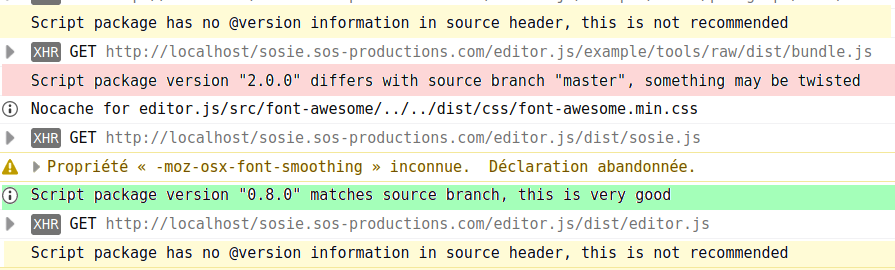

   

# scriptLoader Plugin to load Tools, Modules and Plugins of editor.js


## What's new doc ?

- Since 4.0.0, new load core, anti cache and version coherency works. This last one
 will avoid us to have regression when manipulating submodules and providing examples

## Feature(s)

- Submodules version coherency checker in console

  

- Provides an uniformized way to load tool and scripts thus instead of having:

```html

<script src="https://cdn.jsdelivr.net/npm/@editorjs/header@latest"></script>
<script src="https://cdn.jsdelivr.net/npm/@editorjs/simple-image@latest"></script>
<script src="https://cdn.jsdelivr.net/npm/@editorjs/delimiter@latest"></script>
<script src="https://cdn.jsdelivr.net/npm/@editorjs/list@latest"></script>
<script src="https://cdn.jsdelivr.net/npm/@editorjs/checklist@latest"></script>
<script src="https://cdn.jsdelivr.net/npm/@editorjs/quote@latest"></script>
<script src="https://cdn.jsdelivr.net/npm/@editorjs/code@latest"></script>
<script src="https://cdn.jsdelivr.net/npm/@editorjs/embed@latest"></script>
<script src="https://cdn.jsdelivr.net/npm/@editorjs/link@latest"></script>
<script src="https://cdn.jsdelivr.net/npm/@editorjs/warning@latest"></script>
<script src="https://cdn.jsdelivr.net/npm/@editorjs/underline@latest"></script>
<script src="https://cdn.jsdelivr.net/npm/@editorjs/marker@latest"></script>
<script src="https://cdn.jsdelivr.net/npm/@editorjs/inline-code@latest"></script>
<script src="https://cdn.jsdelivr.net/npm/@editorjs/raw@latest"></script>
<script src="https://cdn.jsdelivr.net/npm/@editorjs/paragraph@latest"></script>

```

we will have:

```js
 /**
     * configure the Editor Tools before the Editor being initialized
     * @note Hack because for now we cannot have async constructors
     * @param {function} configurationHolder a function that returns user configuration {EditorConfig|string|undefined} 
     * @param {boolean] custom , if not specified use demo by default.
     * @return promise<EditorJS>
     */
    async function new_SoSIE(configurationHolder,custom) {
    
       ...
        
         let mode='prod'; //dev will require browserify
        let source='local';
        let editorDir='editor.js';
        
        let target=source+':'+editorDir; 

        /**
        * Load Tools
        */
        await loadTools([
            {'@editorjs/header@latest': ['[example/tools/header](https://github.com/editor-js/header)']}, 
            {'@editorjs/simple-image@latest':['[example/tools/simple-image](https://github.com/editor-js/simple-image)']},
            {'@editorjs/delimiter@latest':['[example/tools/delimiter](https://github.com/editor-js/delimiter)']}, 
            {'@editorjs/list@latest':['[example/tools/list](https://github.com/editor-js/list)']},
            {'@editorjs/checklist@latest':['[example/tools/checklist](https://github.com/editor-js/checklist)']},
            {'@editorjs/quote@latest':['[example/tools/quote](https://github.com/editor-js/quote)']}, 
            {'@editorjs/code@latest':['[example/tools/code](https://github.com/editor-js/code)']},
            {'@editorjs/image@latest':['[example/tools/image](https://github.com/editor-js/image)']}, 
            {'@editorjs/embed@latest':['[example/tools/embed](https://github.com/editor-js/embed)']},
            {'@editorjs/table@latest':['[example/tools/table](https://github.com/editor-js/table)']},
            {'@editorjs/link@latest':['[example/tools/link](https://github.com/editor-js/link)']}, 
            {'@editorjs/warning@latest':['[example/tools/warning](https://github.com/editor-js/warning)']}, 
            {'@editorjs/marker@latest':['[example/tools/marker](https://github.com/editor-js/marker)']},
            {'@editorjs/inline-code@latest':[ '[example/tools/inline-code](https://github.com/editor-js/inline-code)']}, 
            {'@editorjs/paragraph@latest':['[example/tools/paragraph](https://github.com/editor-js/paragraph)']},
            {'@editorjs/raw@latest':['[example/tools/raw](https://github.com/editor-js/raw)']} 
        ],nocache,mode,target);
        
        /**
        * Editor core
        */
        mode='prod'
        source='local';//Works only with local stored dists as we decided not to publish on npm
        target=source+':'+editorDir;
        await loadEditor([
            {'sosie-js/editor.js@0.7.0':['[](https://github.com/sosie-js/editor.js)','dist/sosie.js']},
            {'sos-productions/editor.js@next':['[src/editor.js](https://github.com/sos-productions/editor.js)','../../dist/editor.js'] }
        ],nocache,mode,target)
        
    
        /**
        * Plugins
        */
         await loadPlugins([
            {'sosie-js/script-loader@4.0.0': '[example/plugins/script-loader](https://github.com/sosie-js/script-loader)'}, //virtual , already loaded we keep a version trace here
            {'sosie-js/embed@2.0.0': ['[example/plugins/embed](https://github.com/sosie-js/embed)',['dist/bundle.js','dist/sample.js']]},
            {'sosie-js/tool-configurator@1.0.0':['[example/plugins/tool-configurator](https://github.com/sosie-js/tool-configurator)','dist/bundle.js']}
        ],nocache,mode,target);
        
        ...
    }

```

## Integration

1) Add the loader on top

```html
 <script src="editor.js/plugins/script-loader/dist/build.js"></script>
```

2) You will have to adapt the loader as we can pass the configuration directly but wraping it into
a function and have to add a promise support. Now we have:

```js
 /**
     * To initialize the Editor, create a new instance with configuration object constructor
     * @see docs/installation.md for mode details
     */
     var editor=new_SoSIE(function(){ return {
    
      /**
       * Wrapper of Editor
       */
      holder: 'editorjs',

      /**
       * Tools list
       */
      tools: {
        /**
         * Each Tool is a Plugin. Pass them via 'class' option with necessary settings {@link docs/tools.md}
         */
        header: {
          class: Header,
          inlineToolbar: ['link'],
          config: {
            placeholder: 'Header'
          },
          shortcut: 'CMD+SHIFT+H'
        },

      ...
      },
      onReady: function(){
	saveButton.click();
      },
      onChange: function() {
	console.log('something changed');
      }
    };});

```

3) Inside, new_SoSIE(configurationHolder,custom), an extra line need to be added

```js
        //the configuration is desencapsulated with the good classes context 
        let configuration=configurationHolder(); 
        
```

## Building the plugin

To produce the dist/bundle.js for production use the command: 

```shell
yarn build
```

## Want to give a try?

Play with [SoSie](http://sosie.sos-productions.com/)
